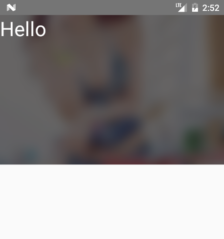

## react-native-image-blur
`react-native-image-blur` is a wrapper for [react-native-blur](https://github.com/react-native-community/react-native-blur). Provide image blurring.

<a href="https://www.npmjs.com/package/react-native-image-blur"></a>
<a href="https://www.npmjs.com/package/react-native-image-blur"></a>



### Installation

```bash
npm install react-native-blur
npm install react-native-image-blur

react-native link react-native-blur
```

Android: Add the following to android/app/build.gradle

```js
android {
    // make sure to use 23.0.3 instead of 23.0.1
    buildToolsVersion '23.0.3'

    // ...
    defaultConfig {
        // Add these lines below the existing config
        renderscriptTargetApi 23
        renderscriptSupportModeEnabled true
    }
}
```

Include the library in your code:

```js
import ImageBlur from 'react-native-image-blur';

<ImageBlur
    source={{ uri: 'xxx' }}
    style={{ width: '100%', height: 240 }}
    blurRadius={6}>
    <Text style={{ color: '#fff', fontSize: 32 }}>Hello</Text>
</ImageBlur>
```

### props

name | type | description
:--- | :--- | :---
style | object | image style
source | object | image source
blurType | string | xlight、light、dark. default is dark.
blurRadius | number | (only android) range:  0 - 25, default is 8.
downsampleFactor | number | (only android) range: > 0, default is null.
blurAmount | number | range: 0 - 100, default is 10.
overlayColor | string | (only android) default is null.


